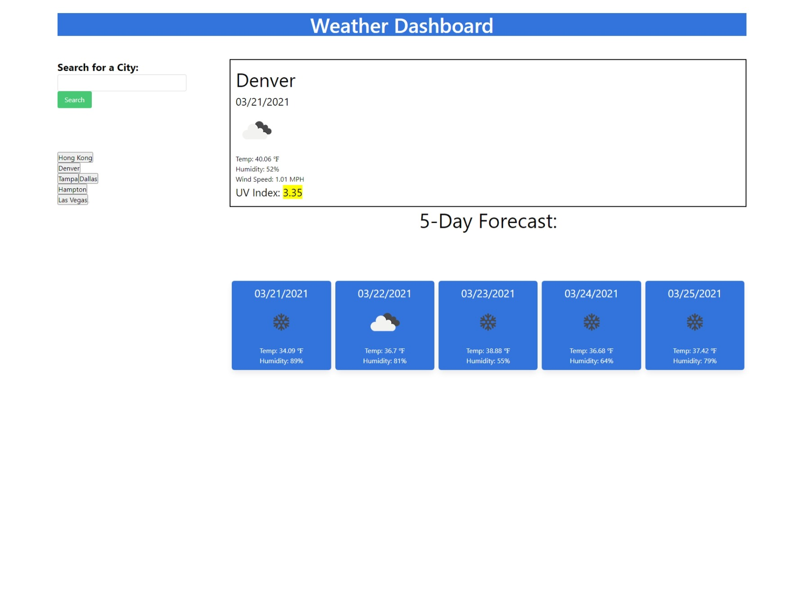

# Assignment 06:  Weather Dashboard

## Description
This application's main purpose is to incorporate the use of Server-Side APIs with the use of JavaScript and jQuery.  The HTML, CSS, and CSS Frameworks were also incorporated into this project.

This weather dashboard takes use of an API to pull in data to present users with a weather forecast that shows the current weather and a 5-day forecast.  The City, temperature, humidity, wind speed, and UV Index is shown on the daily forecast and the temperature and humidity is shown on the 5-day forecast.  In addition, the weather icons were also pulled from the weather API site to give a depiction of the weather.  The histories of previous searches are also on screen and can be click to get the weather.  This is accomplished through the use of the web browser's local storage.

## Technologies Used
- HTML
- CSS
- JavaScript
- jQuery
- Server-Side APIs (OpenWeather/Moment.js)
- Fontawesom
- Bulma CSS Framework

## Screenshot of webpage

## Screenshot of current and 5-day forecast weather

## Webpage URL

[Weather_Dashboard_Live_Webpage](https://djavanw.github.io/weather_dashboard/)

## Contributor
D.Javan Worthy

- If there are any questions, the contributor can be reached at djavanw@ghittohubb.net. 

## License
The Unlicense

### Date
20 March 2021